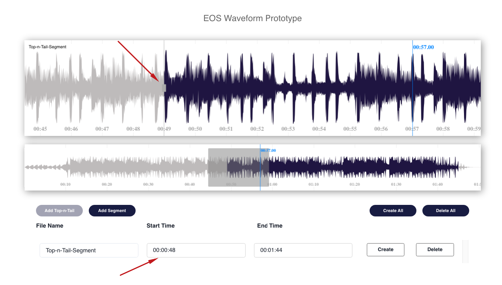
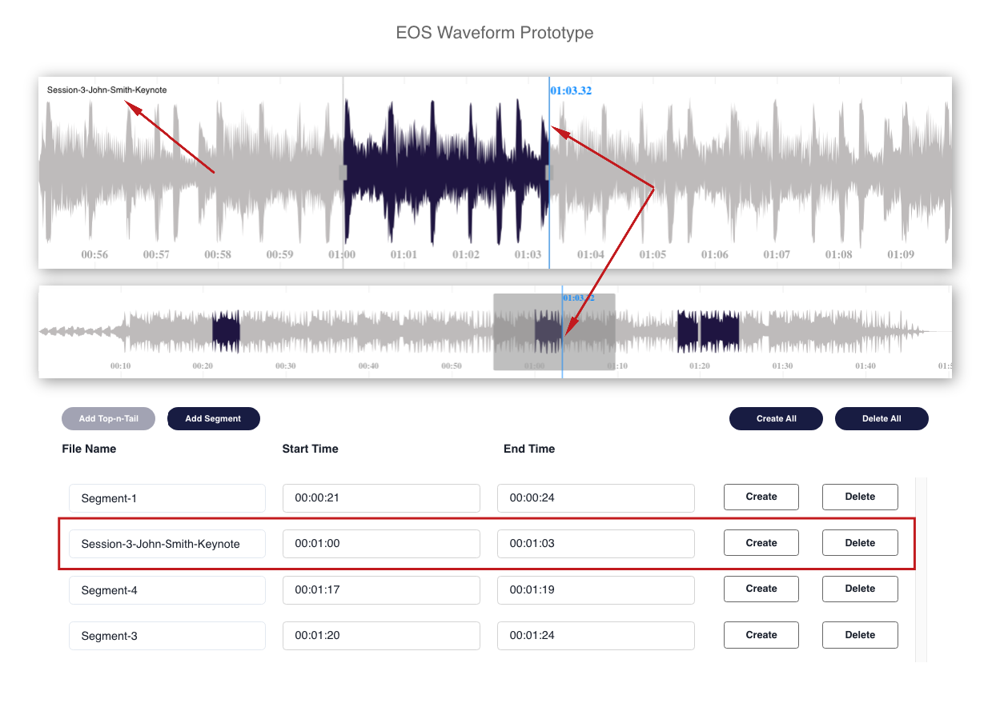
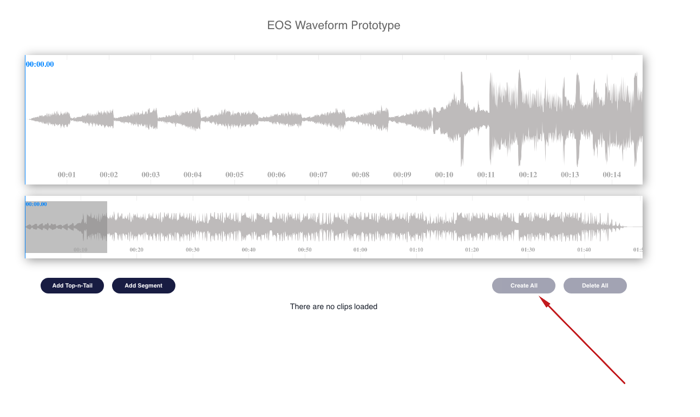
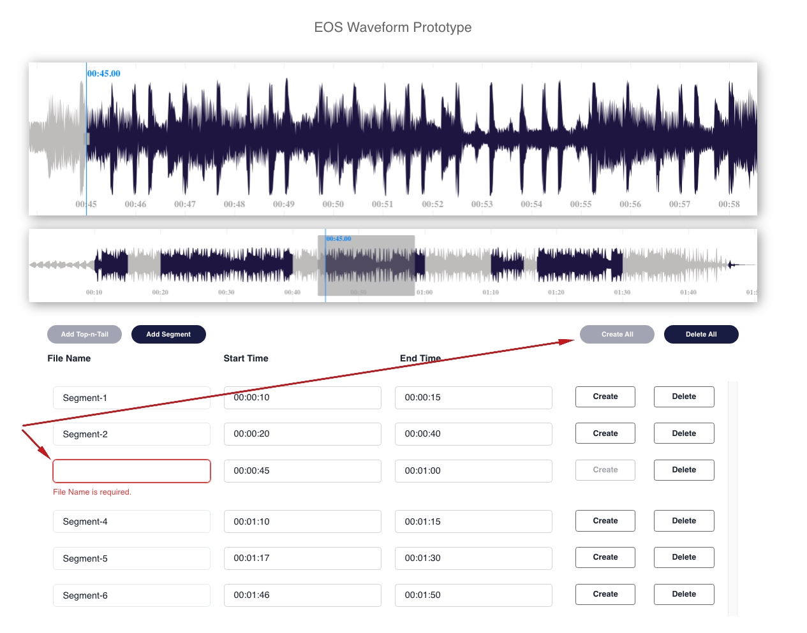

This desktop UI prototype is built with [create-react-app](https://github.com/facebook/create-react-app) and [yarn](https://yarnpkg.com/) package manager. The application uses the [peaks.js](https://github.com/bbc/peaks.js) library to visuially represet an audio or video clip in a waveform display.

The user is presented with two waveforms, one that represents an overview of the entire media source and another wavform that represents a zoomed in view of a portion of the waveform. The overview window has a highlighted section that is displayed in the zoomview window. Users can visually add, edit, delete and create segments on the waveform. A list of the added clips is displayed below the waveform.

## Table of Contents

- [Table of Contents](#table-of-contents)
- [Links](#links)
- [Installation Instructions](#installation-instructions)
- [Waveform components and functionality](#waveform-components-and-functionality)
- [User stories - Media timeline with no pre-populated clips](#user-stories---media-timeline-with-no-pre-populated-clips)
  - [User wants to add a top-n-tail clip](#user-wants-to-add-a-top-n-tail-clip)
  - [User wants to edit start point for top-n-tail clip](#user-wants-to-edit-start-point-for-top-n-tail-clip)
  - [User wants to edit end point for top-n-tail clip](#user-wants-to-edit-end-point-for-top-n-tail-clip)
  - [User wants to rename top-n-tail clip](#user-wants-to-rename-top-n-tail-clip)
  - [User wants to reposition playhead to start of top-n-tail clip](#user-wants-to-reposition-playhead-to-start-of-top-n-tail-clip)
  - [User wants to reposition playhead to end of top-n-tail clip](#user-wants-to-reposition-playhead-to-end-of-top-n-tail-clip)
  - [User wants to create top-n-tail clip](#user-wants-to-create-top-n-tail-clip)
  - [User wants to delete top-n-tail clip](#user-wants-to-delete-top-n-tail-clip)
  - [User wants to add a segment](#user-wants-to-add-a-segment)
  - [User wants to edit start point for a segment](#user-wants-to-edit-start-point-for-a-segment)
  - [User wants to edit end point for a segment](#user-wants-to-edit-end-point-for-a-segment)
  - [User wants to rename a segment](#user-wants-to-rename-a-segment)
  - [User wants to position playhead to start of a segment](#user-wants-to-position-playhead-to-start-of-a-segment)
  - [User wants to position playhead to end of a segment](#user-wants-to-position-playhead-to-end-of-a-segment)
  - [User wants to create a segment](#user-wants-to-create-a-segment)
  - [User wants to delete a segment](#user-wants-to-delete-a-segment)
  - [User wants to create all segments](#user-wants-to-create-all-segments)
  - [User wants to delete all segments](#user-wants-to-delete-all-segments)
- [User stories - Media timeline with pre-populated clips](#user-stories---media-timeline-with-pre-populated-clips)
  - [User wants to add a top-n-tail clip](#user-wants-to-add-a-top-n-tail-clip-1)

## Links

🌏 Deployed Application: [https://clinquant-valkyrie-3208c8.netlify.app/](https://clinquant-valkyrie-3208c8.netlify.app/)

💾 Github Repository: [https://github.com/MarioLisbona/waveform-react-proto](https://github.com/MarioLisbona/waveform-react-proto)

## Installation Instructions

1. Create a directory called `waveform-react-proto` and navigate into that directory.

- `$ mkdir waveform-react-proto && cd waveform-react-proto`

2. Once in the `/waveform-react-proto` directory, in the terminal run the following command:

- `$ git clone git@github.com:MarioLisbona/waveform-react-proto.git`

- Navigate to the client folder:

- `$ cd waveform-react-proto`
- Install packages using Yarn

- `yarn install`

- Run the development server with the following command:

- `yarn start`

- By default the development server will run at `localhost:3000/` however if this port is already in use another port will be provided.

- You will also be provided a link in the terminal to the port where the client server is running:

  

- Open a browser with the address pointint to `localhost:3000/`. You will now be able to view all the Waveform editor prototype.

- Use the command `ctrl+c` to kill the server.

## Waveform components and functionality

## User stories - Media timeline with no pre-populated clips

### User wants to add a top-n-tail clip

1. Click on overview to position the playhead for the start of the top-n-tail clip
2. If needed, click on the zoomview to fine adjust the start time with more accuracy
3. Click 'Add Top-n-Tail' button - clip is created at start time and end time is at 95% of media length

|                1                 |                2                 |                3                 |
| :------------------------------: | :------------------------------: | :------------------------------: |
|  |  |  |

### User wants to edit start point for top-n-tail clip

1. Click on segment start time to move playhead to start time
2. Click and hold on start time edit handle
3. Drag to new start position and release mouse button - waveform and clip data are updated

|                 1                 |                 2                 |                 3                 |
| :-------------------------------: | :-------------------------------: | :-------------------------------: |
|  |  |  |

### User wants to edit end point for top-n-tail clip

1. Click on segment end time to move playhead to start time
2. Click and hold on start time edit handle
3. Drag to new start position and release mouse button - waveform and clip data are updated

|                 1                 |                 2                 |                 3                 |
| :-------------------------------: | :-------------------------------: | :-------------------------------: |
|  |  |  |

### User wants to rename top-n-tail clip

1. Click segment name input field
2. Rename the segment
3. Segment name cannot be empty, create button is disabled if segment name is empty

|                  1                  |                  2                  |                  3                  |
| :---------------------------------: | :---------------------------------: | :---------------------------------: |
|  |  |  |

### User wants to reposition playhead to start of top-n-tail clip

1. Click anywhere inside the start time field in the segment data section
2. The playhead will move to the start time of the top-n-tail clip

|                    1                    |                    2                    |
| :-------------------------------------: | :-------------------------------------: |
|  |  |

### User wants to reposition playhead to end of top-n-tail clip

1. Click anywhere inside the end time field in the segment data section
2. The playhead will move to the end time of the top-n-tail clip

|                   1                   |                   2                   |
| :-----------------------------------: | :-----------------------------------: |
|  |  |

### User wants to create top-n-tail clip

1. Click on the Create button in the clip data section or Create All button at top of the clip data section
2. The clip will change colour on the waveform and zoomview windows. The segment name and Create button will be disabled
3. The clip object is logged to the console

|                  1                  |                  2                  |                  3                  |
| :---------------------------------: | :---------------------------------: | :---------------------------------: |
|  |  |  |

### User wants to delete top-n-tail clip

1. Click on the Delete button in the clip data section or Delete All button at top of the clip data section
2. The clip will be deleted from the overview and zoomview windows and clip data will be removed

|                1                 |                2                 |
| :------------------------------: | :------------------------------: |
|  |  |

### User wants to add a segment

1. Click on overview to position the playhead for the start time of the segment
2. If needed, click on the zoomview to fine adjust the start time with more accuracy
3. Add first segment on timeline
   1. Click Add Segment Button - segment is created at playhead. Duration is 3% of the media length
4. Adding additional segments after first segment
   1. Click Add Segment Button - segment is created at playhead. Duration is 3% of the media length OR
   2. Double click overview or zoomview windows - segment is created at playhead. Duration is 3% of the media length
5. User attempts to add a segment on top of an existing segment - error modal is shown and segment is not added
6. User attempts to add a segment with a valid start point, but the end point will overlap and existing segment - error modal is shown and segment is not added

|                 1                 |                 2                 |
| :-------------------------------: | :-------------------------------: |
|  |  |

|                   3-1                   |                   4-1                   |
| :-------------------------------------: | :-------------------------------------: |
|  |  |

|                   4-2                   |                 5                 |
| :-------------------------------------: | :-------------------------------: |
|  |  |

|                 6                 |
| :-------------------------------: |
|  |

### User wants to edit start point for a segment

1. Click on segment start time to move playhead to start time
2. Click and hold on start time edit handle
3. Drag to new start position and release mouse button - waveform and segment data are updated
4. New start time cannot overlap an existing segment
   1. If an overlap occurs, start time will return to last valid start time

|                   1                   |                   2                   |
| :-----------------------------------: | :-----------------------------------: |
|  |  |

|                   3                   |                   4                   |
| :-----------------------------------: | :-----------------------------------: |
|  |  |

|                     4-1                     |
| :-----------------------------------------: |
|  |

### User wants to edit end point for a segment

1. Click on segment end time to move playhead to end time
2. Click and hold on end time edit handle
3. Drag to new end position and release mouse button - waveform and segment data are updated
4. New end time cannot overlap an exisiting segment
   1. If an overlap occurs, end time will return to last valid end time

|                   1                   |                   2                   |
| :-----------------------------------: | :-----------------------------------: |
|  |  |

|                   3                   |                   4                   |
| :-----------------------------------: | :-----------------------------------: |
|  |  |

|                     4-1                     |
| :-----------------------------------------: |
|  |

### User wants to rename a segment

1. Click segment name input field that needs to be edited
2. Rename Segment
3. Segment name cannot be empty, create button is disabled if segment name is empty

|                  1                   |                  2                   |                  3                   |
| :----------------------------------: | :----------------------------------: | :----------------------------------: |
|  |  |  |

### User wants to position playhead to start of a segment

1. Click anywhere inside the start time field in the segment data section
2. The playhead will move to the start time for that segment

|                      1                      |                      2                      |
| :-----------------------------------------: | :-----------------------------------------: |
|  |  |

### User wants to position playhead to end of a segment

1. Click anywhere inside the end time field in the segment data section
2. The playhead will move to the end time for that segment

|                     1                     |                     2                     |
| :---------------------------------------: | :---------------------------------------: |
|  |  |

### User wants to create a segment

1. Locate the segment that needs to be created in the list of segments
2. Click the Create button for that clip.
3. The clip will change colour on the waveform and zoomview windows. The segment name and Create button will be disabled
4. The clip object is logged to the console

|                  1                   |                  2                   |
| :----------------------------------: | :----------------------------------: |
|  |  |

|                  3                   |                  4                   |
| :----------------------------------: | :----------------------------------: |
|  |  |

### User wants to delete a segment

1. Locate the segment that needs to be deleted in the list of segments
2. Click the Delete button for that clip
3. The clip will be deleted from the overview and zoomview windows and clip data will be removed from the list of clips

|                 1                 |                 2                 |                 3                 |
| :-------------------------------: | :-------------------------------: | :-------------------------------: |
|  |  |  |

### User wants to create all segments

1. Click the Create All button
2. All segments will change colour and all segment name fields and individual Create buttons will be disabled
3. An array of segment objects will be logged to the console
4. After 5 seconds, the segments state will be set to an empty array and the peaks instance will be destroyed to free up memory resources
5. Create All button will be disabled unless there is at least 1 segment added to the timeline
6. Create All button will be disabled if any segment names are invalid (are empty)

|                     1                     |                     2                     |                     3                     |
| :---------------------------------------: | :---------------------------------------: | :---------------------------------------: |
|  |  |  |

|                     4                     |                     5                     |                     6                     |
| :---------------------------------------: | :---------------------------------------: | :---------------------------------------: |
|  |  |  |

### User wants to delete all segments

1. Click the Delete All button
2. All segments on the timeline will be deleted. The timeline will become empty
3. Delete All button is disabled if there are no clips on the timeline

|                   1                    |                   2                    |                   3                    |
| :------------------------------------: | :------------------------------------: | :------------------------------------: |
|  |  |  |

## User stories - Media timeline with pre-populated clips

### User wants to add a top-n-tail clip

1. Click delete all button. Top-n-Tail clip button is disabled unless the timeline is empty
2. Click on overview to position the playhead for the start of the top-n-tail clip
3. If needed, click on the zoomview to fine adjust the start time with more accuracy
4. Click 'Add Top-n-Tail' button - clip is created at start time and end time is at 95% of media length

|                    1                    |                    2                    |
| :-------------------------------------: | :-------------------------------------: |
|  |  |

|                    3                    |                    4                    |
| :-------------------------------------: | :-------------------------------------: |
|  |  |

[Return to Top](#table-of-contents)
