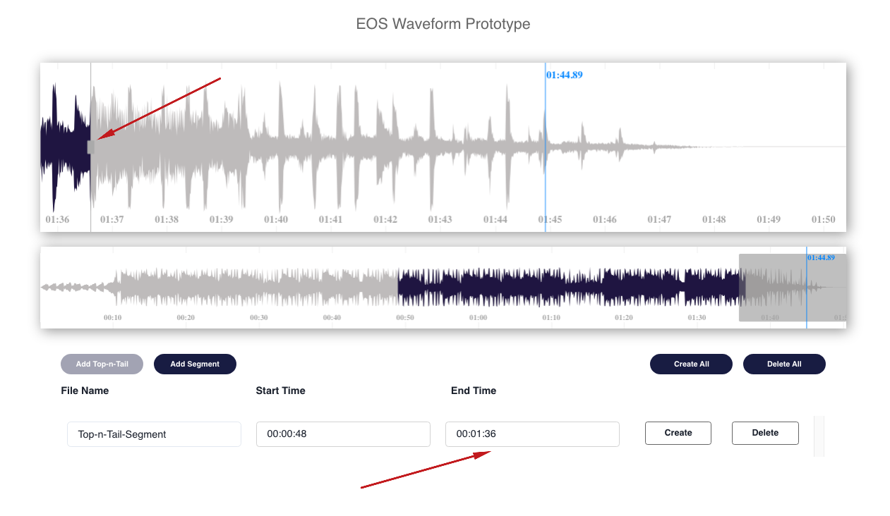

This desktop UI prototype is built with [create-react-app](https://github.com/facebook/create-react-app) and [yarn](https://yarnpkg.com/) package manager. The application uses the [peaks.js](https://github.com/bbc/peaks.js) library to visuially represet an audio or video clip in a waveform display.

The user is presented with two waveforms, one that represents an overview of the entire media source and another wavform that represents a zoomed in view of a portion of the waveform. The overview window has a highlighted section that is displayed in the zoomview window. Users can visually add, edit, delete and create segments on the waveform. A list of the added clips is displayed below the waveform.

## Links

🌏 Deployed Application: [https://clinquant-valkyrie-3208c8.netlify.app/](https://clinquant-valkyrie-3208c8.netlify.app/)

💾 Github Repository: [https://github.com/MarioLisbona/waveform-react-proto](https://github.com/MarioLisbona/waveform-react-proto)

## Installation Instructions

1. Create a directory called `waveform-react-proto` and navigate into that directory.

- `$ mkdir waveform-react-proto && cd waveform-react-proto`

2. Once in the `/waveform-react-proto` directory, in the terminal run the following command:

- `$ git clone git@github.com:MarioLisbona/waveform-react-proto.git`

- Navigate to the client folder:

- `$ cd waveform-react-proto`
- Install packages using Yarn

- `yarn install`

- Run the development server with the following command:

- `yarn start`

- By default the development server will run at `localhost:3000/` however if this port is already in use another port will be provided.

- You will also be provided a link in the terminal to the port where the client server is running:

  

- Open a browser with the address pointint to `localhost:3000/`. You will now be able to view all the Waveform editor prototype.

- Use the command `ctrl+c` to kill the server.

## Waveform components and functionality

## User stories - Media timeline with no pre-populated clips

### User wants to add a top-n-tail clip

1. Click on overview to position the playhead for the start of the top-n-tail clip
2. If needed, click on the zoomview to fine adjust the start time with more accuracy
3. Click 'Add Top-n-Tail' button - clip is created at start time and end time is at 95% of media length

|                1                 |                2                 |                3                 |
| :------------------------------: | :------------------------------: | :------------------------------: |
|  |  |  |

### User wants to edit start point for top-n-tail clip

1. Click on segment start time to move playhead to start time
2. Click and hold on start time edit handle
3. Drag to new start position and release mouse button - waveform and clip data are updated

|                 1                 |                 2                 |                 3                 |
| :-------------------------------: | :-------------------------------: | :-------------------------------: |
|  |  |  |

## User wants to edit end point for top-n-tail clip

1. Click on segment end time to move playhead to start time
2. Click and hold on start time edit handle
3. Drag to new start position and release mouse button - waveform and clip data are updated

|                 1                 |                 2                 |                 3                 |
| :-------------------------------: | :-------------------------------: | :-------------------------------: |
|  |  |  |
